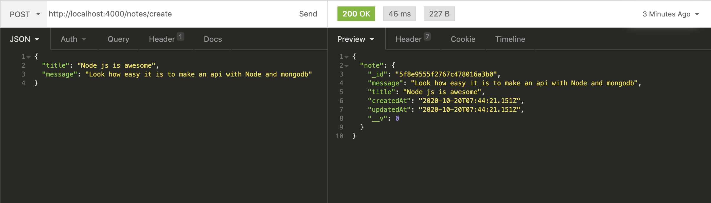

APIs are the foundation of how web is working these days, modern day application are using APIs more and more everyday, the concept of JAMstack changed the way how frontend applications are built.

Let's make a simple API with Nodejs where we call our database built with Mongo DB.

**Prerequisites**

- Make sure you have installed the lates <a href="https://nodejs.org/en/" target="_blank">Node.js</a>
- <a href="https://www.mongodb.com/try/download/community" target="_blank">MongoDB</a> on your computer
- Any code editor in your system

We will follow this article step by step

### 1. Create a Node project & install dependencies

Let's begin by creating a Node.js project, by opening your terminal and type `npm init`. You can fill the details it asks for and it will create a new folder in the directory you initialized the project.

No go into that project folder by running the `cd` command, we need to install express and mongoose as dependencies, to do that simply run the below command.

`npm i express mongoose`

- Express is a very popular Node.js framework, an industry standard to make Node.js apps.
- Mongoose is a Mongo DB Data modelling tool and a wrapper to Mongo DB (It makes connecting and communicating to our Database easier)

### 2. Setup our server (Write code)

Now that we have installed Express and Mongoose, let's get our hands dirty and write some code.

Create a file in the project directory called index.js and open it in any code editor of your choice.

We will import express and mongoose which we installed in step 1 by using the require statement.

```jsx
const express = require('express')
const mongoose = require('mongoose')
```

Now create an instance of express and let's call it `app()` and also add a listener on specified port - 4000.

```jsx
const app = express();
app.listen(4000, () => console.log('App is listening on port 4000'))
```

This is how our server setup will look like.

```jsx
const express = require('express');
const mongoose = require('mongoose');

const app = express();

app.listen(4000, () => console.log('App is listening on port 4000'));
```

Let's make a small route added in our server - a route is an url which will call specific methods in our server.

```jsx
const express = require('express');
const mongoose = require('mongoose');

const app = express();

app.get("/", (req, res) => {
 res.send({
	message: "Hello World!"
 });
});

app.listen(4000, () => console.log('App is listening on port 4000'));
```

Save the file and open your terminal in your project root folder and run command `node index.js` it should print this the line **App is listening on port 4000**.

Open the port 4000 in your browser, Postman or Insomnia, you will be seeing the below message printed.


We've our server skeleton ready.

### 3. Creating a MongoDB database and connecting it to our server

> Before beginning, make sure Mongo DB is installed and running in your computer.

To create a database, you simply need to create a mongoose instance and add a name to you Database.

Note: If a database with the name `notes_db` already exists in your system, mongoose will connect to that database.

```jsx
mongoose.connect('mongodb://127.0.0.1:27017/notes_db', { useNewUrlParser: true })
const db = mongoose.connection
db.on('error', (error) => console.error(error))
db.once('open', () => console.log('Database connection succesful'))
```

The default url used by mongodb is `mongodb://127.0.0.1:27017/` and your append the database name to its end to connect to it

```jsx
const express = require("express");
const mongoose = require("mongoose");

const app = express();

mongoose.connect("mongodb://127.0.0.1:27017/notes_db", {
  useNewUrlParser: true, 
  useCreateIndex: true,
});
const db = mongoose.connection;
db.on("error", (error) => console.error(error));
db.once("open", () => console.log("Database connection succesful"));

app.get("/", (req, res) => {
  res.send({
    message: "Hello World!",
  });
});

app.listen(4000, () => console.log("App is listening on port 4000"));
```

Now that we have our database and server setup, we will be making a Notes app where you can **Create**, **Read**, **Update** or **Delete** (CRUD) a note.

 

### 4. Creating a CRUD app

So we will make a app where our server which will create notes, which will have a title and message, this is called a schema, we need to tell Mongo DB to expect these things when we create a note in the database, in order to that, let's make a model of the note for mongoose, create a file called schema.js and add the below code in it. 

```jsx
const mongoose = require('mongoose');
const Schema = mongoose.Schema;
const NoteSchema = Schema(
    {
        title: {type: String, required: true},
        message: {type: String, required: true},
    }, 
    { timestamps: true }
);
const Note = mongoose.model("Note", NoteSchema);
module.exports = Note;
```

This is a straightforward schema where we are initializing mongoose and a creating an instance of Mongo DB Schema and specifically instructing that it will have two fields title and message and we are naming this instance **Name.**

### 5. Creating routes for our CRUD transactions

We will create 4 routes for 4 different operations

1. GET request - `/notes/read` - This will list all our notes in the database
2. POST request - `/notes/create` - This will create a new note in our database.
3. PUT request - `/notes/update/:id` - This will update a existing note by accepting the note **id**.
4. DELETE request - `/notes/delete/:id` This will delete a note by **id**.

Before we begin, let's install `body-parser` this will allow us to accept body payloads for the POST request, you do so by running command `npm i body-parser.`

This the final code to our api, explaination below.

```jsx
const express = require("express");
const mongoose = require("mongoose");
const bodyParser = require("body-parser");

const app = express();

//Initialize the Note model
const Note = require("./schema");

// Connect to Database
mongoose.connect(
  "mongodb+srv://<Username>:<Password>@test.abcde.mongodb.net/notes_db",
  {
    useNewUrlParser: true,
    useCreateIndex: true,
  }
);
const db = mongoose.connection;
db.on("error", (error) => console.error(error));
db.once("open", () => console.log("Database connection succesful"));

app.use(bodyParser.json());
app.use(bodyParser.urlencoded({ extended: true }));

// List all notes
app.get("/notes/list", (req, res) => {
  Note.find({})
    .sort({ updatedAt: "descending" })
    .exec((err, notes) => {
      if (err) return res.status(404).send("Error Fetching Notes");
      return res.send(notes);
    });
});

// Create a new Note
app.post("/notes/create", (req, res) => {
  if (req.body.title && req.body.message) {
    const note = new Note({ message: req.body.message, title: req.body.title });
    note.save((err) => {
      if (err) return res.status(404).send({ message: err.message });
      return res.send({ note });
    });
  } else res.status(404).send({ message: "Title and message missing" });
});

// Update existing note
app.put("/notes/update/:id", (req, res) => {
  if (req.body.title && req.body.message) {
    let options = { new: true };
    Note.findByIdAndUpdate(req.params.id, req.body, options, (err, note) => {
      if (err) return res.status(404).send({ message: err.message });
      return res.send({ message: "Note updated successfully!", note });
    });
  } else res.status(404).send({ message: "Title and message missing" });
});

// Delete existing note
app.post("/notes/delete/:id", (req, res) => {
  Note.findByIdAndRemove(req.params.id, (err) => {
    if (err) return res.status(404).send({ message: err.message });
    return res.send({ message: "Note deleted succesfully!" });
  });
});

app.listen(4000, () => console.log("App is listening on port 4000"));
```

Okay, this might look a little overwhelming, but it's very simple. 

1. Let's create a note by calling `/notes/create` route and set the method type to **POST**.



When we hit this route, the `app.post("/notes/create")` function is invoked and there we have a small check for seeing if we have sent title and message in the request, if not we will respond with a error.

If everything goes well, our server will create a note and respond back with an id, createdAt timestamp.

2. Listing All the Notes, simply call the `/notes/list` route and it will respond back will all out notes in the database.


3. Similarly to update the note let's send the id to `/notes/update/:id` route and set the method to **PUT**. Once it is successfully processed, you will see the below response.


You get the gist for **DELETE**.

So, there we have it, a simple node js api. We learned

1. How to create a Node server
2. How to connect to our database
3. Create Mongoose Models
4. Create GET, POST, PUT & DELETE methods of the REST api architecture.

To read more about mongoose you can refer the official <a href="https://mongoosejs.com/" target="_blank">docs</a>.

Thanks for reading my noob style tutorial. I hope this will help you to know something new. So, if you have suggestions and feedback about this post then let me know. hello@mohddanish.me