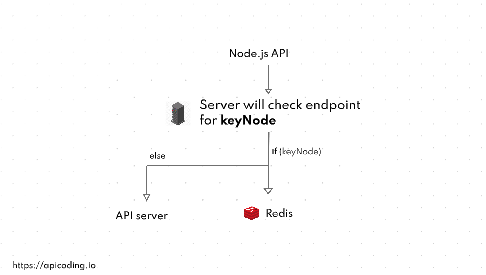

If your application is serving a single endpoint so frequents and the data served by API is changing on a period of time then you can save that data with fast serving technology to optimize your server performance.

Redis is a key-value based open source database tool and is the best solution to make our API endpoint fast with caching.

### Basic Logic flow



The logic is so simple and easy to setup. Let's suppose we are caching for 60 seconds.

When you make API call to server first time then Redis service stores the response on a unique **key node** as raw data for 60 seconds and after 60 seconds that **key node auto expired**.

After that, If you make your **second call** with your endpoint then we check **keyNode exist or not**. If keyNode is available then return responce from Redis otherwise proceed to API server.

### Crating Node.js Project

If you building from scratch then make a folder using command line. Go to the folder and run `yarn init -y` to initialize the project `package.json` file.

Now add two dependencies into the project we need to build our APIs endpoints. `Express` is framework of Node.js for API developments & `Redis` is for caching management.

```
yarn add express redis
```

Create a file into root folder for your application logic and add this basic code.

```javascript
const express = require('express')
const app = express()
const router = express.Router()

router.get('/apiWithCache', (req,res) => {
    res.send({"message": "This endpoint is optimized with redis caching."})
})

router.get('/apiWithoutCache', (req,res) => {
    res.send({"message": "This endpoint making fresh call."})
})

app.use('/',router)

app.listen(3000)
```

In the above code, we just add two API endpoints.

### Caching helper logic

Now we just need a caching helper to add with our endpoints. Make a file `cachingHelper.js` into root folder.

```javascript
const redis = require('redis')
const client = redis.createClient();

module.exports = (req, res, next) => {
    const keyNode = req.url;
        client.get(keyNode, function(err, reply) {
                if (reply) {
                        res.send(JSON.parse(reply));
                } else {
                        res.sendResponse = res.send;
                        res.send = body => {
                                if (res.statusCode === 200) {
                                        // caching time is 60 seconds
                                        client.set(keyNode, JSON.stringify(body), 'EX', 60);
                                }

                                res.sendResponse(body);
                        };
                        next();
                }
        });
}
```

In the above code, `const keyNode = req.url` is taking reference of the requested URL.

If you make a request below URL then `req.url` will be `/apiWithCache`

```
http://localhost:3000/apiWithCache
```

After that, `client.get()` will check the keyNode availability.

If `reply` is true that mean the endpoint cache result is available and will return cached result with `parse`.

If `reply` is null then request will go to API server and callback to that block with `res.send` and then result will be cached for `60 seconds` with `client.set(keyNode, JSON.stringify(body), 'EX', 60)` if `res.statusCode === 200`

Now add the `helper` into `app.js` file like this.

```javascript
const express = require('express')
const app = express()
const router = express.Router()
const cachingHelper = require('./cachingHelper')

router.get('/apiWithCache', cachingHelper, (req,res) => {
    res.send({"message": "This endpoint is optimized with redis caching."})
})

router.get('/apiWithoutCache', (req,res) => {
    res.send({"message": "This endpoint making fresh call."})
})

app.use('/',router)

app.listen(3000)
```

Yes, that's all. Now optimized your server with redis magic.