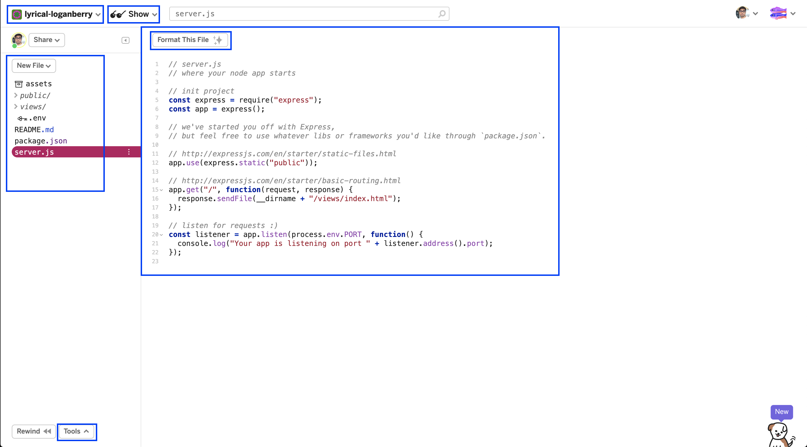
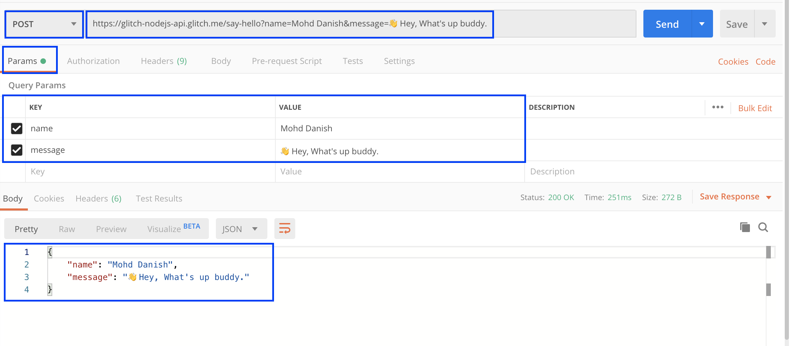

Nowadays building nodejs API in the browser is so easy with Glitch and you can also be hosted for free. I'm a big fan of this tool and using glitch API into my projects. You don't need to install any tools, you just need a browser with the internet.

Let's start in short.

- Create an account here <a href="https://glitch.com/" target="_blank" rel="noopener noreferrer">glitch.com</a>.
- Create `New Project`
- Select `hello-express` template. 



So, after creating a new express project you will see that view. this has all features in a single window. 

Now go to `server.js` file and replace with this basic code.

```javascript
const express = require("express");
const app = express();

app.get("/", function(request, response) {
    response.send({message: "Glitch is so powerful. 💪"})
});

const listener = app.listen(process.env.PORT, function() {
    console.log("Your app is listening on port " + listener.address().port);
});
```

There is only one `GET` route that `/` and you can use your nodejs APIs with glitch sub-domain url. `https://<project_name>.glitch.me/`

Let's make an simple `POST` route where we send some data and will return as JSON. Add this new code snippts into `server.js`

```javascript
app.post("/say-hello", function(request, response) {
    const {name, message} = request.query
    response.send({name, message})
});
```

If you send data as `query params` then you will recive into `request.query` & if you send into `body` then you will get through `request.body`.

Now test `POST` call into Postman tool. URL: `https://<project_name>.glitch.me/say-hello`



Here is the complete code URL. https://glitch.com/edit/#!/glitch-nodejs-api

Here I'm listing all the features that will be useful to build and debug your nodejs APIs.

### You can:
- Make your glitch project private.
- Remix your glitch project into a new project.
- Invite others to edit your project.
- Embed the project into your portfolio website.
- Live view your project with a glitch endpoint. Ex: `https://<project_name>.glitch.me`
- Format the files with one click.
- View your APIs logs into the browser.
- Import/Export into git.
- Custom Domain.

Yes, it's all free for you to build your project, learn & experiment. it's really fun to build things with no hassle.

Thanks for reading my noob style tutorial. I hope this will help you to know something new.

