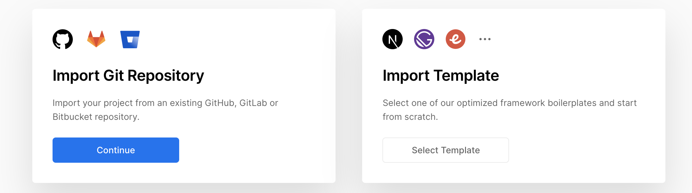

We will be making a api service where you will pass a url and in return get the live screenshot of that website.

### Prerequisites

1. Basics of Javascript.
2. Latest Node.js installed in locally
3. [Vercel Dev](https://vercel.com/docs/cli) (If you want to test them locally)

### TL;DR

If you want to see a live version of how this work, <a href="https://websitescreenshot.vercel.app/api/screenshot?url=https%3A%2F%2Fgoogle.com" target="_blank">here is a live demo</a>

### Making the API

It works like this any js file you add under a folder called `api/` will become an api.

Vercel is a platform to host static websites for free and one advantage is you also get serverless functions, for free but with some limitations - (1GB ram), you can read more about <a href="https://vercel.com/docs/serverless-functions/introduction" target="_blank">vercel serverless functions</a>. Vercel currently supports functions in 4 languages - Node.js, Go, Python & Ruby. We will be using Node of course.

So we will be using something called <a href="https://playwright.dev/" target="_blank">playwright</a>, an open source project by Microsoft, it is based on top of <a href="https://pptr.dev/" target="_blank">Google's Chrome Puppeteer</a>. 

The catch is you cannot directly use playwright or puppeteer directly inside as a serverless function, there are open source versions meant for playwright and puppeteer, we will be using this one in our api <a href="https://github.com/JupiterOne/playwright-aws-lambda" target="_blank">https://github.com/JupiterOne/playwright-aws-lambda</a>

### 1. Creating a Node project and installing dependencies

To create a node project simply make a folder and just run `npm init -y` in your terminal in that directory. This will initialize a node project and add a file called package.json in it.

Now to install our playwright package run `npm install playwright-core playwright-aws-lambda --save` in your terminal. 

We have our dependencies ready.

### 2. Coding our api

As per the docs, we will create a folder called `/api` and we will create a file called **screenshot.js** inside. 

The api is very simple and below is the code. You can find the explanation below.

```jsx
const playwright = require("playwright-aws-lambda");

module.exports = async (req, res) => {
  let browser = null;
  const { query } = req;
  try {
    if (query.url && isValidUrl(query.url)) {
      browser = await playwright.launchChromium({ headless: true });
      const context = await browser.newContext();
      const page = await context.newPage();
      await page.goto(query.url);
      const screenshot = await page.screenshot({ type: "png" });
      res.setHeader("Content-Type", "image/png");
      res.status(200).send(screenshot);

    } else throw "Please provide a valid url";

  } catch (error) {
    res.status(500).send({
      status: "Failed",
      error
    });

  } finally {
    if (browser !== null) {
      await browser.close();
    }
  }

};

function isValidUrl(string) {
  try {
    new URL(string);
  } catch (_) {
    return false;
  }
  return true;
}
```


1. Import Playwright library in your file
2. Check if the URL is valid - the URL validation method `isValidUrl` is at the end.
3. Here is where the actual work is done, we had a variable called browser initialized and we are opening a playwright headless browser (A browser which can be controlled with code). We will open a new page and pass the url to it with `await page.goto('https://google.com')` and we will use the page.screenshot method to get a screenshot of resolution 1280x720. 
4. Now that we have the screenshot, we will respond back the client with it, we need to set the header `"Content-Type", "image/png"` so that the user requesting it will see the image.
5. Finally let's close the browser in step 5 - We need to do this so the serverless function won't timeout and break.

### Hosting on vercel

Let's push this code to a github repo and create a vercel account click on Import Project. Copy the github repo url and use the Import Git Repository and enter the repo url.



Click continue and you vercel will create your project and assign it a URL. 

There you go, you now have a screenshot as a service api working live.

There are some limitations though, the api will break if the website you are trying to take a screenshot is very huge, say this will break if you try to screenshot of BBC or something with heavy images and websites with very fancy fonts will be just shown as boxes, same goes for emojis.

So go ahead and try to make something out of this, you could try changing the format to JPG, you  can even try to get a PDF of the website by using the `.pdf` method <a href="https://playwright.dev/#version=v1.5.1&path=docs%2Fapi.md&q=pagepdfoptions" target="_blank">https://playwright.dev/#version=v1.5.1&path=docs%2Fapi.md&q=pagepdfoptions</a>, you can see a demo of the <a href="https://websitescreenshot.vercel.app/api/pdf?url=https%3A%2F%2Fgoogle.com" target="_blank">pdf heres</a>[pdf here].

Thanks for reading my noob style tutorial. I hope this will help you to know something new. So, if you have suggestions and feedback about this post then let me know. hello@mohddanish.me